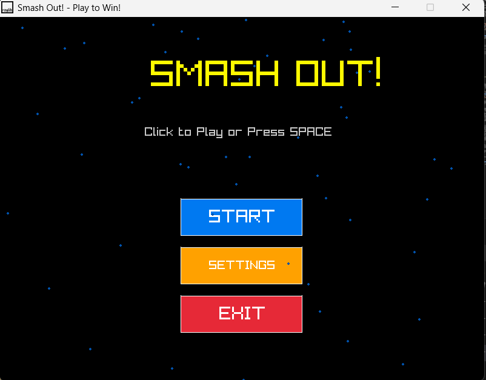
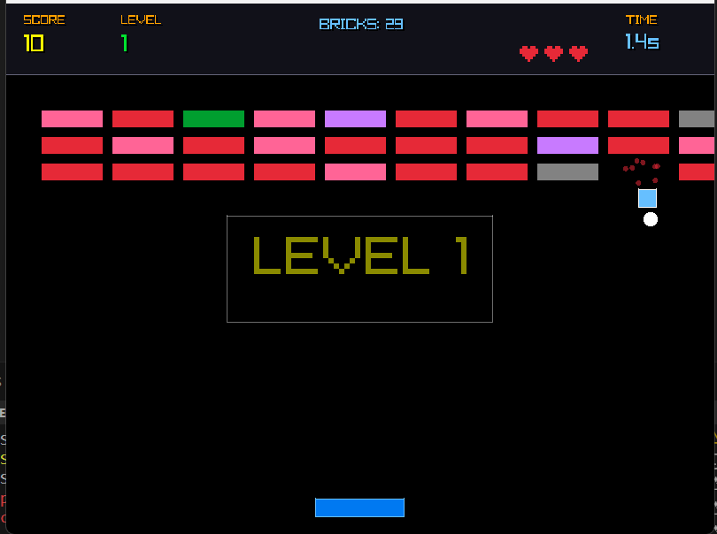
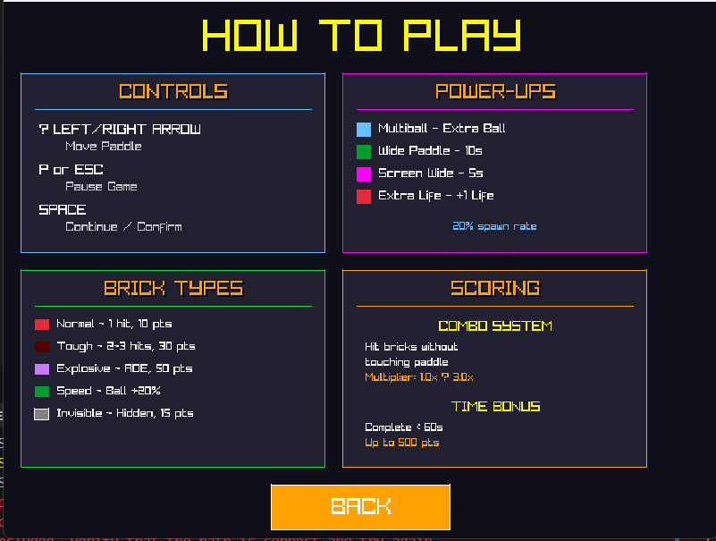
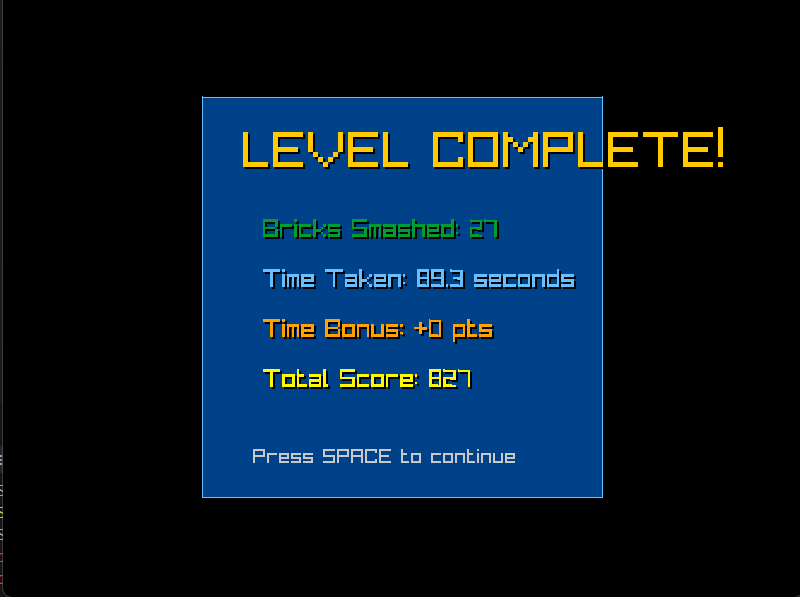
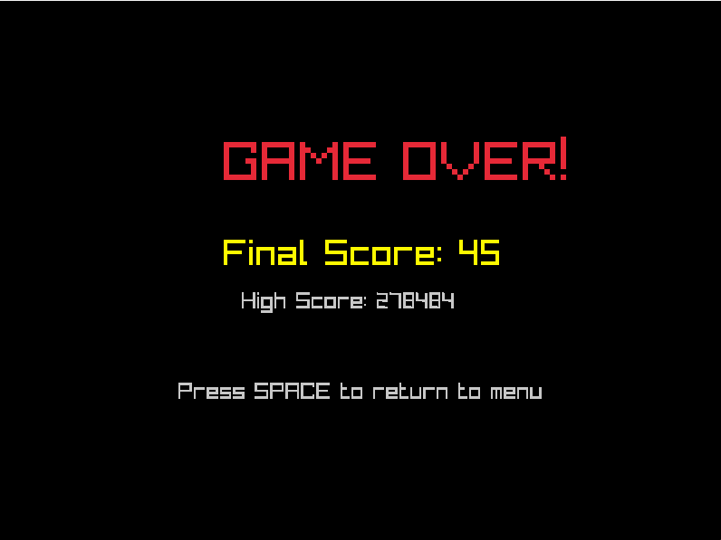
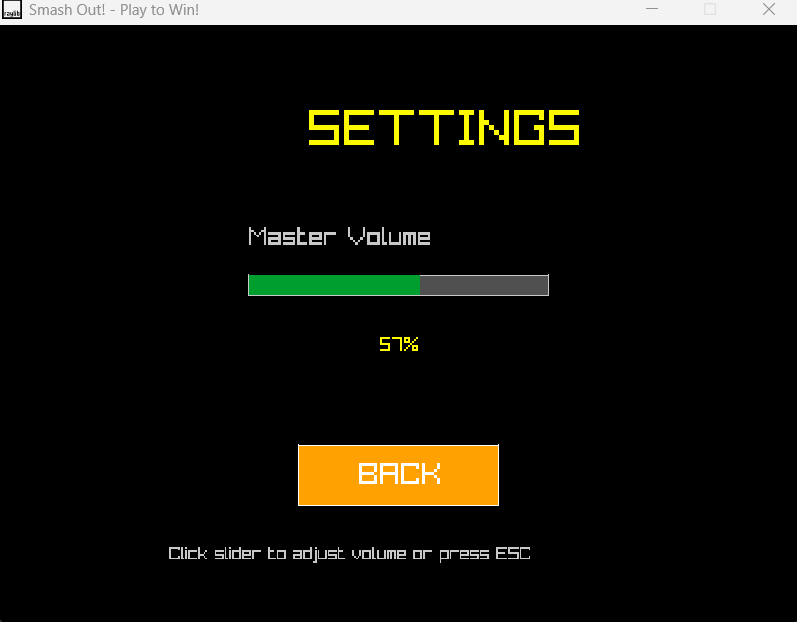

# Smash Out! - A Raylib Breakout Game

A feature-rich breakout/brick-breaker game built with **Raylib** and **C99**. Bounce a ball off your paddle to destroy bricks, earn points, and progress through dynamically generated levels with increasing difficulty.

## Features

### Core Gameplay
- **Classic Breakout Mechanics**: Bounce a ball off your paddle to destroy bricks and clear levels
- **Progressive Difficulty**: Speed increases and brick patterns change with each level
- **Lives System**: Start with 3 lives; gain extra lives through power-up drops
- **Score Tracking**: Earn points for each brick destroyed with HUD display

### Advanced Systems
- **Procedural Level Generation**: Levels dynamically scale in difficulty with:
  - Scaling brick rows (2 base rows + 1 per level, capped at 8)
  - Pattern variations (standard, checkerboard for even levels, pyramid for divisible by 3)
  - Ball speed increases (0.5f per level)

- **Advanced Brick Types** (5 types with unique mechanics):
  - **NORMAL**: 1 hit, 10 points
  - **TOUGH**: Requires 2-3 hits, 30 points
  - **EXPLOSIVE**: Destroys nearby bricks on impact (AOE), 50 points
  - **SPEED**: Ball speed increases by 20%, 15 points
  - **INVISIBLE**: Hidden until ball gets close, 15 points

- **Combo System**: 
  - Multiplier increases for consecutive brick hits without touching paddle
  - Range: 1.0x to 3.0x multiplier
  - Floating combo text appears at brick destruction and fades out
  - Golden text display in HUD when active

- **Time Bonus System**:
  - Earn up to 500 bonus points for completing a level in under 60 seconds
  - Time counter displays in HUD during gameplay
  - Bonus applied to score upon level completion

- **Power-Up System**: Random drops with 20% spawn chance per destroyed brick:
  - **MULTIBALL**: Spawns an additional ball for simultaneous gameplay
  - **WIDE_PADDLE**: Doubles paddle width for 10 seconds
  - **SCREEN_WIDE**: Expands paddle to full screen width for 5 seconds
  - **EXTRA_LIFE**: Grants an additional life (capped at 5 maximum)

- **Modern Minimalist HUD** (y: 0-80 pixel bar):
  - **Left Section**: Score and Level (large yellow/green text)
  - **Center Section**: Brick count, Active combo multiplier (when active)
  - **Right Section**: Time elapsed, Lives (pixel-art hearts, max 5), Buff progress bar
  - Semi-transparent background with clean separator line
  - Perfectly centered text using MeasureText() for alignment

- **Visual Polish & Feedback**:
  - Screen shake effect on brick destruction
  - Particle effects on destroyed bricks (colored particles)
  - Ball trail animation (fades behind ball trajectory)
  - Paddle squash effect when ball hits
  - Floating combo text with fade-out effect
  - Death animation with 12-particle shatter when ball falls
  - Level notifications with semi-transparent backgrounds

- **Audio System**:
  - Menu background music (looping)
  - Sound effects for: brick hits, wall hits, paddle hits, losing hearts, game over, power-up collection
  - Master volume control in Settings (0-100%)

- **Settings Menu**:
  - Interactive volume slider (click and drag support)
  - Real-time volume adjustment with `SetMasterVolume()`
  - Percentage display
  - Easy navigation back to menu

### Game States
- **MENU**: Main menu with interactive buttons and animated background particles
- **PLAYING**: Core gameplay with modern HUD, collision detection, and entity management
- **PAUSED**: Pause overlay showing game stats and resume/quit options
- **LEVEL_SUMMARY**: Level completion summary with bricks destroyed, time taken, and time bonus
- **SETTINGS**: Volume control and configuration options
- **GAME_OVER**: Game over screen with final score and high score display
- **WIN**: Victory screen for completing all levels
- **HOW_TO_PLAY**: Tutorial page with 4-card grid layout explaining controls, power-ups, brick types, and scoring

## Controls

| Action | Key |
|--------|-----|
| Move Paddle Left | `LEFT ARROW` |
| Move Paddle Right | `RIGHT ARROW` |
| Pause Game | `P` or `ESC` |
| Resume / Confirm | `SPACE` |
| Navigate Menu | Click buttons |
| Adjust Volume | Click slider |
| View How to Play | Click "HOW TO PLAY" button |
| Exit Game | Click EXIT button or press `Q` in pause menu |

## Screenshots

### Main Menu
The main menu features an animated title with particle effects, interactive buttons with hover feedback, and a clean modern arcade aesthetic.



### Gameplay & HUD
The modern minimalist HUD displays:
- **Left**: Score and Level (large yellow/green text)
- **Center**: Active brick count and combo multiplier
- **Right**: Elapsed time, lives (pixel-art hearts), and power-up buff progress bar



### How to Play Tutorial
A comprehensive 4-card grid layout explaining:
- **Controls**: Arrow keys, pause, and continue commands
- **Power-Ups**: Visual icons and descriptions for all 4 power-up types
- **Brick Types**: All 5 brick types with their properties and point values
- **Scoring**: Combo system and time bonus mechanics



### Level Complete Summary
Displays level statistics including:
- Bricks destroyed
- Time taken
- Time bonus earned
- Total score for the level



### Game Over Screen
Shows final score, high score comparison, and prompt to return to menu



### Settings Menu
Clean interface for adjusting master volume with a visual progress bar and percentage display



## Technical Details

### Requirements
- **Raylib**: Game framework for graphics, audio, and input
- **C99 Standard**: Compiled with MinGW gcc
- **Platform**: Windows (w64devkit)

### Project Structure
```
Smash-Out-Game/
├── src/
│   ├── smash_out.c          # Main game source code
│   ├── Makefile             # Build configuration
│   └── resources/
│       └── Wav/             # Audio files (mp3, wav)
├── resources/
│   └── images/              # Game assets
├── README.md                # This file
└── LICENSE                  # Project license
```

### Build & Run

**Compile the game:**
```bash
cd src
mingw32-make clean
mingw32-make
```

**Run the executable:**
```bash
.\smash_out.exe
```

Or use one command:
```bash
mingw32-make clean && mingw32-make && .\smash_out.exe
```

### Code Architecture

**Key Data Structures:**
- `Ball`: Tracks position, velocity, radius, and active state (array of up to 5)
- `Brick`: Rectangle and active state (10×5 grid, ~50 per level)
- `PowerUp`: Type, position, size, and color (up to 50 simultaneous)
- `GameState`: Enum for menu, playing, game over, win, and settings states

**Key Functions:**
- `LoadLevel()`: Procedurally generates levels based on current level number
- `SpawnPowerUp()`: Randomly creates power-ups at brick destruction points
- `SpawnBall()`: Adds new ball with velocity variation (for MULTIBALL)
- `DrawButton()`: Interactive button with hover detection
- `DrawTextWithShadow()`: Text rendering with shadow offset for readability
- `UpdateParticles()` / `DrawParticles()`: Menu background animation

**Global Variables:**
- `currentLevel`: Tracks player progress
- `levelNotificationTimer`: Manages level notification fade effects
- `masterVolume`: Master audio volume (0.0 to 1.0)

## Game Loop Flow

1. **Initialization**: Load audio, textures, and set up game state
2. **Menu State**: Display interactive menu with particle background
3. **Settings State**: Allow volume adjustment via slider
4. **Playing State**:
   - Update paddle position based on arrow keys
   - Move all active balls and handle collisions (walls, paddle, bricks)
   - Check for power-up collection
   - Update power-up buffs with timers
   - Check win condition (all bricks destroyed)
5. **Game Over/Win States**: Display results and allow return to menu
6. **Audio Management**: Stream menu music, play sound effects for events

## Features Implemented

✅ Core breakout gameplay with ball physics and paddle control  
✅ Brick destruction with collision detection  
✅ **Advanced Brick System** - 5 brick types with unique mechanics (Normal, Tough, Explosive, Speed, Invisible)  
✅ Lives system with visual pixel-art hearts display (max 5)  
✅ Score tracking with modern minimalist HUD (3-section layout)  
✅ Audio integration (8+ sound effects + menu music)  
✅ Power-up system (4 types with visual feedback)  
✅ Multi-ball support (up to 5 simultaneous balls)  
✅ Professional interactive menu with animations  
✅ Procedural level system with dynamic difficulty scaling  
✅ **Combo Multiplier System** - Consecutive hits boost score (1.0x to 3.0x)  
✅ **Time Bonus System** - Bonus points for fast level completion (<60s)  
✅ **High Score Persistence** - Saved to file with resume capability  
✅ **Pause Menu** - Resume, view stats, or quit mid-game  
✅ **Level Summary Screen** - Stats summary with auto-advance or manual continue  
✅ **Death Animation** - Particle shatter effect when ball falls  
✅ **How to Play Tutorial** - 4-card grid layout with controls, power-ups, bricks, and scoring info  
✅ Visual effects (screen shake, particles, ball trail, paddle squash)  
✅ Floating combo text with fade-out animation  
✅ Text centering using MeasureText() for pixel-perfect alignment  
✅ Professional text shadows for visual depth  
✅ Level notifications with fade effects  
✅ Settings menu with master volume control  

## Future Enhancements

- Additional power-up types (slow ball, fast ball, laser paddle)
- Difficulty settings (affecting ball speed, power-up spawn rate)
- Boss levels at milestones
- Additional visual effects (screen distortion, lens flare)
- Leaderboard system with top 10 scores
- Mobile touch support
- Keyboard shortcut hints in How to Play
- Level-specific themes and background colors

## License

See [LICENSE](LICENSE) file for details.

## Credits

Built with **Raylib** - A simple and easy-to-use library to enjoy videogames programming.  

**Audio Assets**: Sound effects and music sourced from [Mixkit](https://mixkit.co) - Free music, sound effects, and stock video library.

**Development**: Created as a portfolio project showcasing C99 game development with Raylib.
